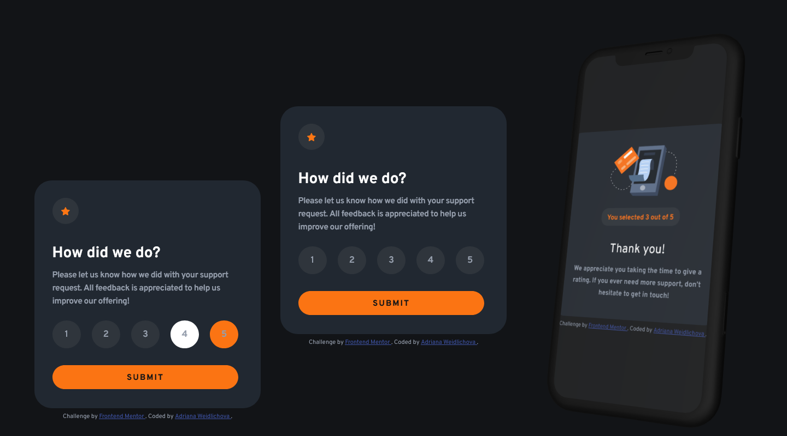

# Frontend Mentor - Interactive rating component solution

This is my Vanilla JS solution to the [Interactive rating component challenge on Frontend Mentor](https://www.frontendmentor.io/challenges/interactive-rating-component-koxpeBUmI).

## Table of contents

- [Frontend Mentor - Interactive rating component solution](#frontend-mentor---interactive-rating-component-solution)
  - [Table of contents](#table-of-contents)
  - [Overview](#overview)
    - [The challenge](#the-challenge)
    - [Screenshot](#screenshot)
    - [Links](#links)
  - [My process](#my-process)
    - [Built with](#built-with)
    - [What I learned](#what-i-learned)
    - [Continued development](#continued-development)
    - [Useful resources](#useful-resources)
    - [AI Collaboration](#ai-collaboration)
  - [Author](#author)
  - [Acknowledgments](#acknowledgments)

## Overview

### The challenge

In this version, I focused on understanding JavaScript basics, such as Event Listeners and manipulating DOM elements without using frameworks.
Users should be able to:

- View the optimal layout for the app depending on their device's screen size
- See hover states for all interactive elements on the page
- Select and submit a number rating
- See the "Thank you" card state after submitting a rating

### Screenshot



### Links

- Solution URL: [Github Repository](https://github.com/Saliva-sys/rating-component-vanilla.git)
- Live Site URL: [Live URL](https://saliva-sys.github.io/rating-component-vanilla/)

## My process

### Built with

- Semantic HTML5 markup
- CSS custom properties
- Flexbox
- Mobile-first workflow
- Responsive design
- Vanilla Javascript

### What I learned

In this project, I focused on mastering the "Input - Process - Output" logic using vanilla JavaScript. Also, I focused on managing component states using JavaScript and CSS classes. I learned how to handle the CSS cascade when toggling between `display: flex` and `display: none` using a dedicated `.hidden` utility class.Here are the key takeaways:

_1. DOM Manipulation & Selectors_
I practiced how to accurately identify and "grab" HTML elements so JavaScript can interact with them. Understanding the difference between selecting a single element (querySelector) and a collection of elements (querySelectorAll) was crucial for this layout.

_2. Handling Collections with .forEach()_
Instead of writing unique code for each rating button (1-5), I implemented the forEach method. This allowed me to apply a single click listener to the entire group of buttons, keeping the code "DRY" (Don't Repeat Yourself).

```js
ratingSelection.forEach((rating) => {
  rating.addEventListener("click", () => {
    // Logic for selection happens here
  });
});
```

_3. State Reset Logic_
One of the biggest challenges was ensuring that only one rating is selected at a time. I learned to implement a "Reset" loop that clears the active styles from all buttons before applying the "Selected" style to the clicked one.

_4. Data Continuity & UI Switching_
I learned how to store a user's choice in a variable (allRating) so it persists even after the initial UI (the rating card) is hidden. Switching between the "Rating" and "Thank You" states was handled by toggling a .hidden CSS class.

```js
if (allRating > 0) {
  userRating.textContent = allRating; // Transferring data to the next screen
  ratingCard.classList.add("hidden"); // UI State Switch
  thanksCard.classList.remove("hidden");
}
```

_5. Clean CSS Reset for Interactive Elements_
I learned the importance of a custom CSS reset for buttons to remove browser-default styles. This provided a "blank canvas" that allowed me to have full control over the hover and active states via JavaScript and CSS variables. I also implemented a small "reset" feature where clicking the Thank You title reloads the page, allowing for a better user experience during testing.

```javascript
// My favorite snippet - page reset on click
thankYou.addEventListener("click", () => {
  window.location.reload();
});
```

### Continued development

In future projects, I want to focus on:

- **Accessibility (a11y)**: I want to learn how to make interactive elements like these rating buttons more accessible to screen readers, perhaps by using `aria-live` regions or better keyboard navigation.
- **CSS Animations**: I'd like to experiment more with micro-interactions, such as adding a slight "pop" effect when a rating is selected or a smooth fade-in transition when the Thank You card appears.
- **State Management**: While Vanilla JS is great for this scale, I am interested in exploring how frameworks like React handle component states in more complex applications.

### Useful resources

- [Variable Fonts Guide (MDN)](https://developer.mozilla.org/en-US/docs/Web/CSS/Guides/Fonts/Variable_fonts) - This guide helped me understand how to implement the Work Sans variable font and control font weights dynamically.
- [BEM Methodology](https://getbem.com/) - Using BEM helped me keep my CSS organized and avoid naming conflicts, which is crucial for larger projects.
- [Clamp Generator](https://clampgenerator.com/) – This tool was essential for calculating fluid values for my layout, allowing the design to scale perfectly between mobile and desktop.
- [CSS Flexbox Layout Guide](https://css-tricks.com/snippets/css/a-guide-to-flexbox/) – This is my go-to reference for Flexbox. It helped me perfectly align the icons and headings within the accordion buttons.

### AI Collaboration

This project was a great exercise in working with an AI assistant (Gemini 3 Flash).

- **Technical Brainstorming**: I used Gemini as a sparring partner to brainstorm layout solutions and debug complex CSS behaviors, specifically regarding the interaction between variable fonts and layout spacing.
- **Problem Solving**: AI helped me identify and fix the "hidden" browser-default styles for buttons and helped me refine my clamp() calculations.
- **Workflow**: Gemini assisted in organizing the CSS architecture and ensuring the project structure was clean and professional.

## Author

- Frontend Mentor - [@Saliva-sys](https://www.frontendmentor.io/profile/Saliva-sys)
- GitHub - [Saliva-sys](https://github.com/Saliva-sys)

## Acknowledgments

I would like to thank the Frontend Mentor community for providing such great challenges to practice real-world web development skills.
